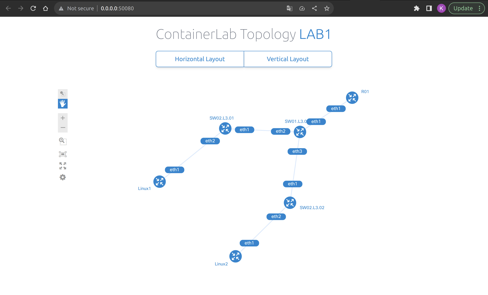
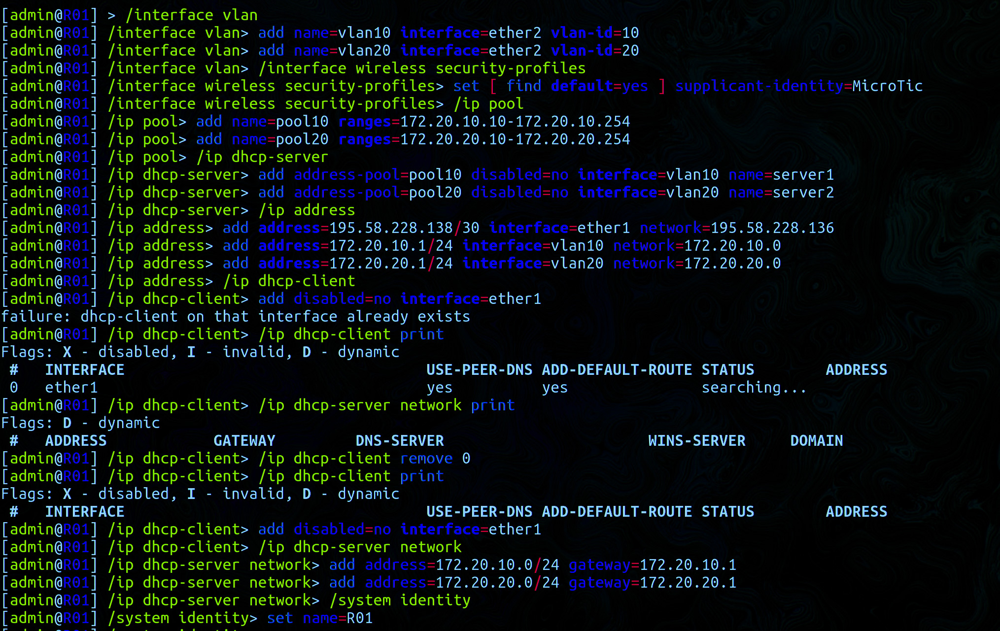
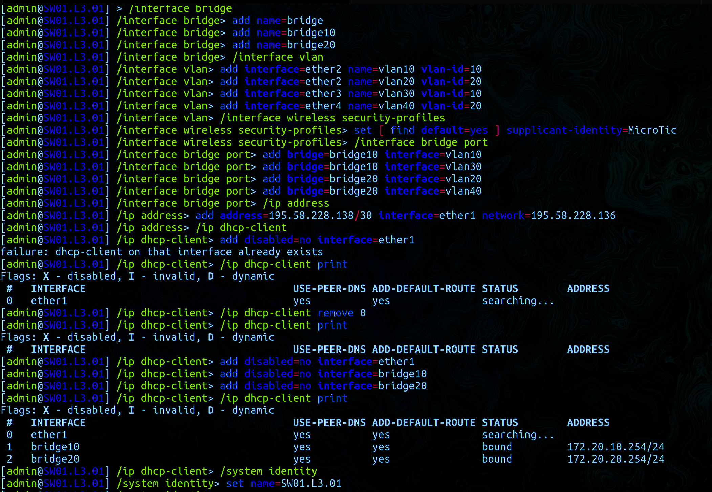
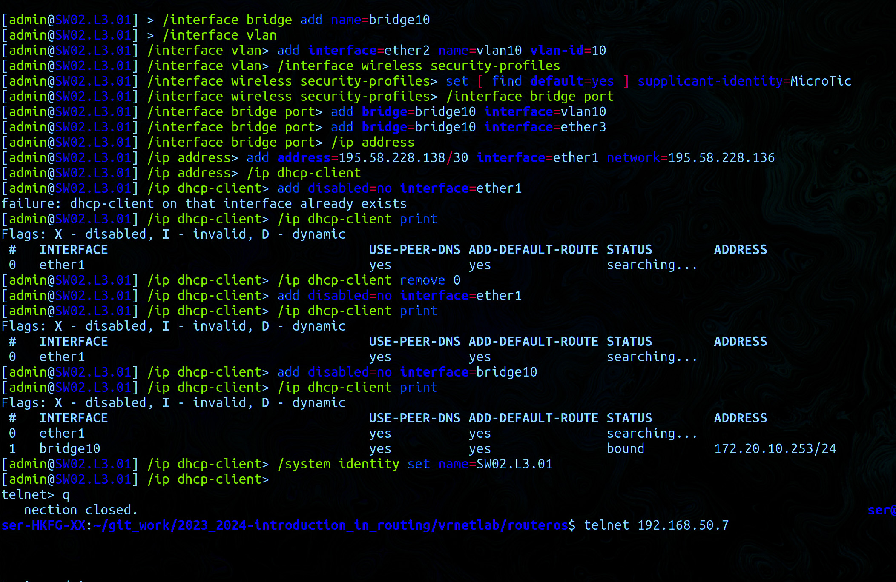
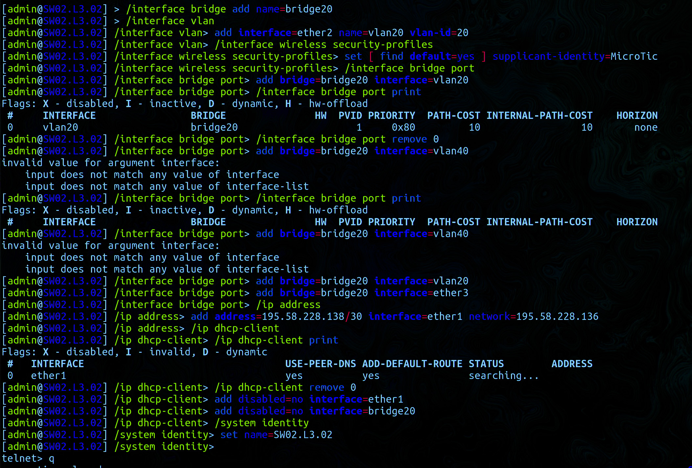
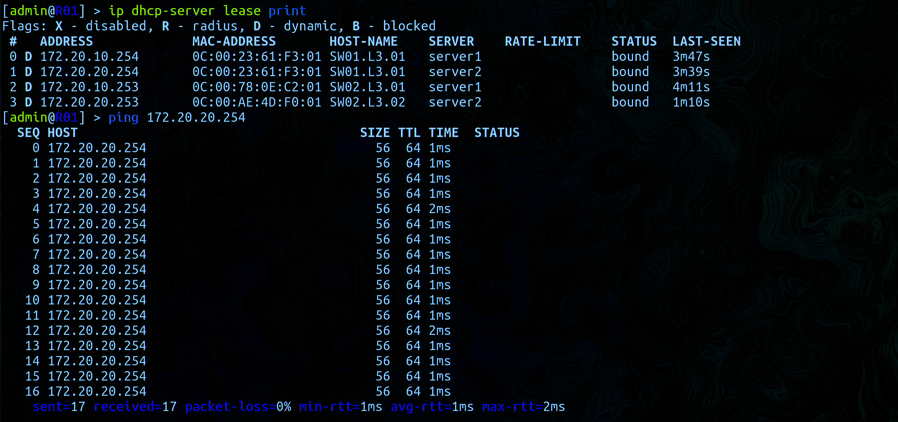
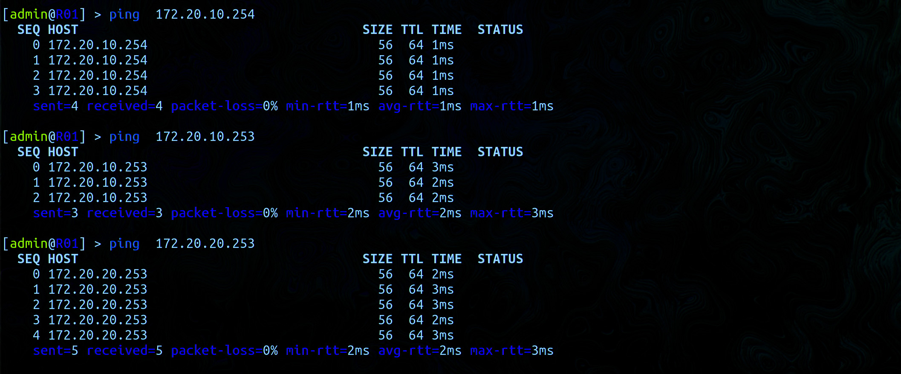

University: [ITMO University](https://itmo.ru/ru/)  
Faculty: [FICT](https://fict.itmo.ru)  
Course: [Introduction in routing](https://github.com/itmo-ict-faculty/introduction-in-routing)  
Year: 2024/2025  
Group: K3320  
Author: Kirollos Mamdouh Eskander Rezkallah  
Lab: Lab1  
Date of create: 11.09.2024  
Date of finished: 29.09.2024

## Laboratory work No. 1 "Installation of ContainerLab and deployment of a test communication network"

## The purpose of the work

To get acquainted with the Containerlib tool and methods of working with it, to study the operation of VLAN, IP addressing, etc.

## Progress of work

### Network

Creation of a three-level communication network of a classic enterprise.

```
name: lab1

topology:
  nodes:
    R01:
      kind: vr-ros
      image: vrnetlab/vr-routeros:6.47.9
      mgmt-ipv4: 192.168.50.2

    Linux1:
      kind: linux
      image: alpine:latest
      cmd: sleep infinity
      mgmt-ipv4: 192.168.50.3

    Linux2:
      kind: linux
      image: alpine:latest
      cmd: sleep infinity
      mgmt-ipv4: 192.168.50.4

    SW01.L3.01:
      kind: vr-ros
      image: vrnetlab/vr-routeros:6.47.9
      mgmt-ipv4: 192.168.50.5

    SW02.L3.01:
      kind: vr-ros
      image: vrnetlab/vr-routeros:6.47.9
      mgmt-ipv4: 192.168.50.6

    SW02.L3.02:
      kind: vr-ros
      image: vrnetlab/vr-routeros:6.47.9
      mgmt-ipv4: 192.168.50.7

  links:
      - endpoints: ["R01:eth1", "SW01.L3.01:eth1"]
      - endpoints: ["SW01.L3.01:eth2", "SW02.L3.01:eth1"]
      - endpoints: ["SW02.L3.01:eth2", "Linux1:eth1"]
      - endpoints: ["SW01.L3.01:eth3", "SW02.L3.02:eth1"]
      - endpoints: ["SW02.L3.02:eth2", "Linux2:eth1"]

mgmt:
  network: static
  ipv4-subnet: 192.168.50.0/24
```

The network topology after assembly is shown in the photo below `sudo containerlab deploy networklab.yaml`:  
`sudo containerlab graph`



## Configuring the router R01



## Configuring SW01.L3.01



## Configuring SW02.L3.01



## Configuring SW02.L3.02



## Checking availability





## Conclusion

As a result of the laboratory work, we were able to familiarize ourselves with the Containerlib tool, as well as create a network and configure devices based on Linux and RouterOS.
