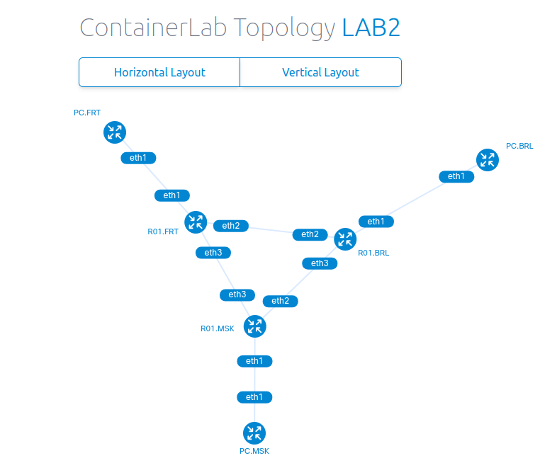

University: [ITMO University](https://itmo.ru/ru/)  
Faculty: [FICT](https://fict.itmo.ru)  
Course: [Introduction in routing](https://github.com/itmo-ict-faculty/introduction-in-routing)  
Year: 2024/2025  
Group: K3320  
Author: Rezkallah Kirollos  
Lab: Lab2  
Date of create: 15.10.2024  
Date of finished: 18.10.2024

## Laboratory work No.2 "Emulation of a distributed corporate communication network, setting up static routing between branches"

## Progress of work

### Network diagram

1. Creating a network diagram

### Configuring routers

1. The MSK router.

2. The FRT router.

3. The BRL router.

### Setting up computers

1. Setting up a computer in Moscow

2. Setting up a computer in Frankfurt

3. Setting up a computer in Berlin

## Checking availability

1. MSK -> BRL; MSK -> FRT

2. FRT -> BRL; FRT -> MSK

3. BRL -> MSK; BRL -> FRT

## Conclusion

As a result of the laboratory work, it was possible to get acquainted with the principles of IP address planning, static routing settings and network functions of devices.
