University: [ITMO University](https://itmo.ru/ru/)  
Faculty: [FICT](https://fict.itmo.ru)  
Course: [Introduction in routing](https://github.com/itmo-ict-faculty/introduction-in-routing)  
Year: 2024/2025  
Group: K3320  
Author: Rezkallah Kirollos  
Lab: Lab3  
Date of create: 31.10.2024  
Date of finished: 3.11.2024

## Laboratory work No. 3 "Emulation of a distributed corporate communication network, setting up OSPF and MPLS, organization of the first EoMPLS"

## The purpose of the work

To study OSPF and MPLS protocols, EoMPLS organization mechanisms.

## Progress of work

### PC1 and Router SPB

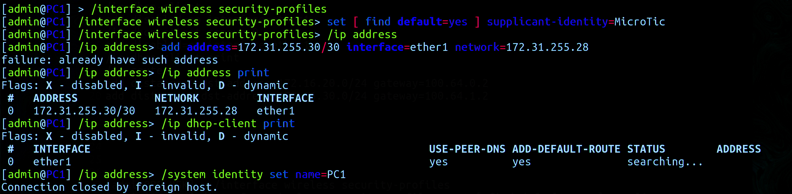

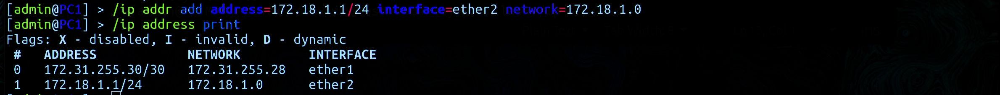

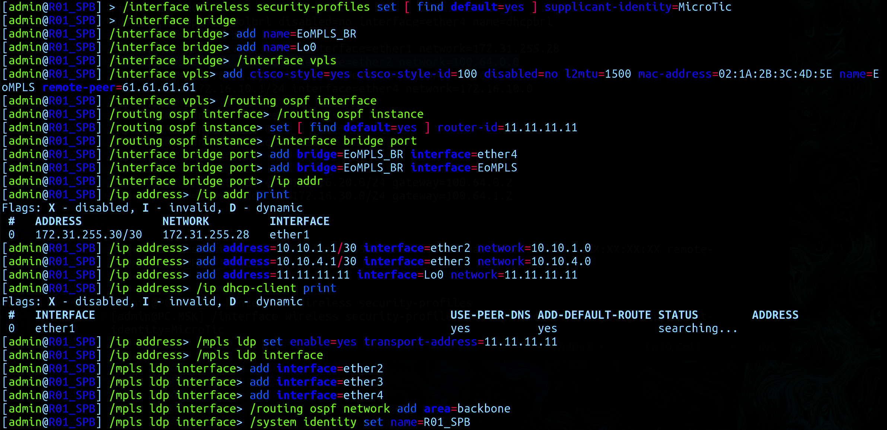

### Routers HKI; MSK; LBN; LND

Configuring the HKI Router

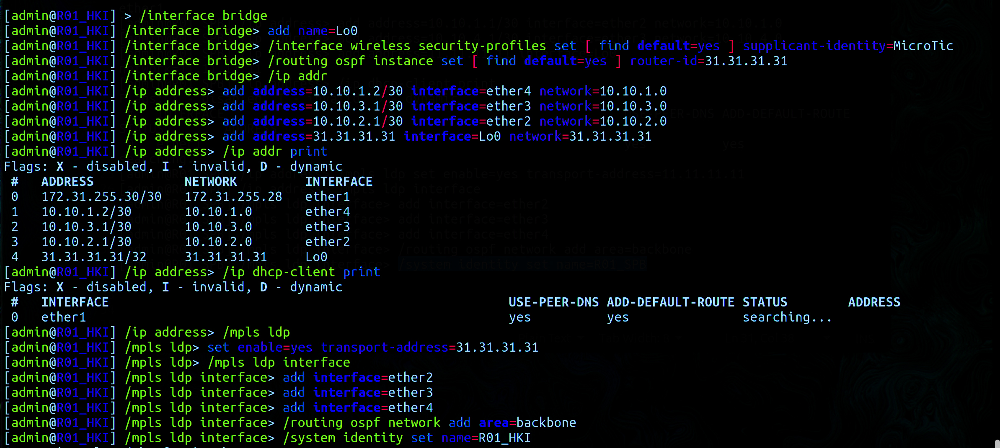

Configuring the MSK router

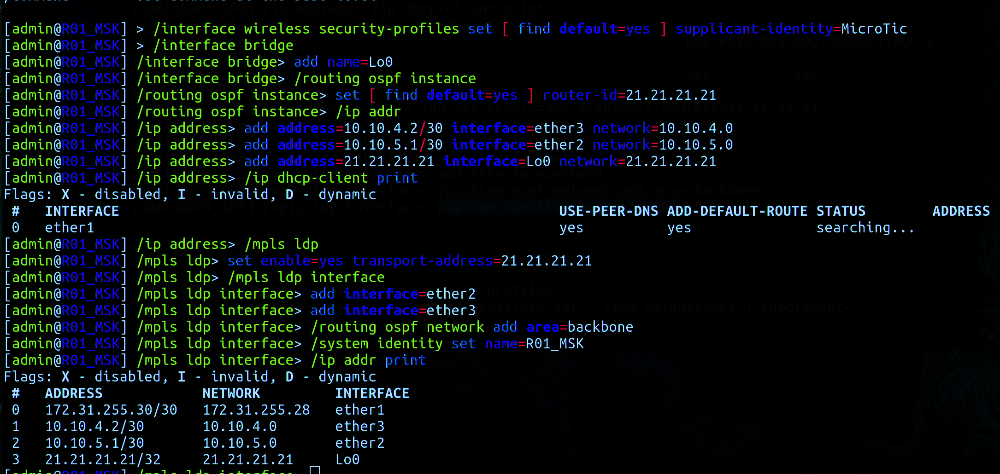

Configuring the LBN router

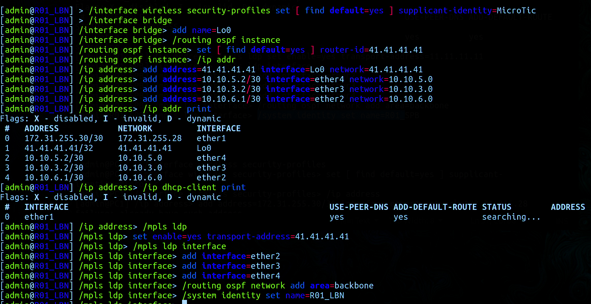

Configuring the LND router

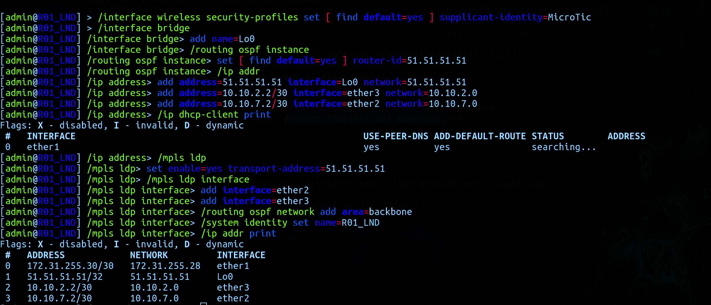

### SGI_Prism and Router NYC

Configuring the NYC Router

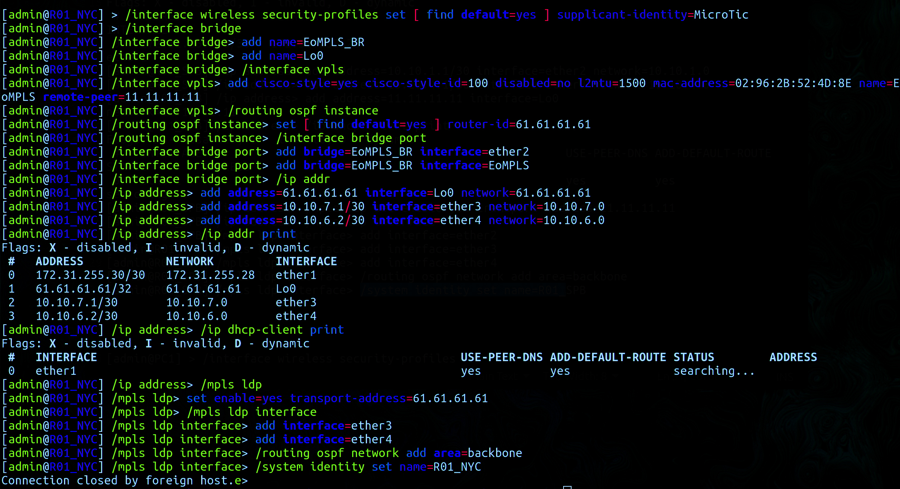

Setting up SGI_Prism

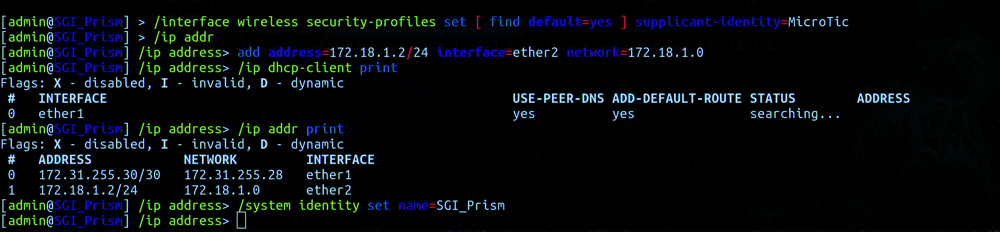

### Check

The result of the MPLS configuration

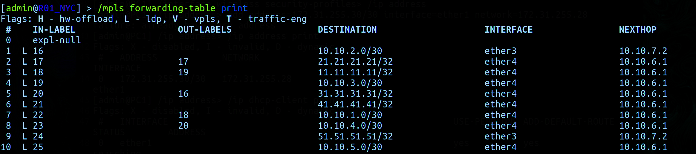

 
Tracking the route from the NYC router to the SPB router

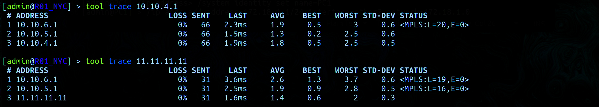

icmp request from SGI_Prism to PC1

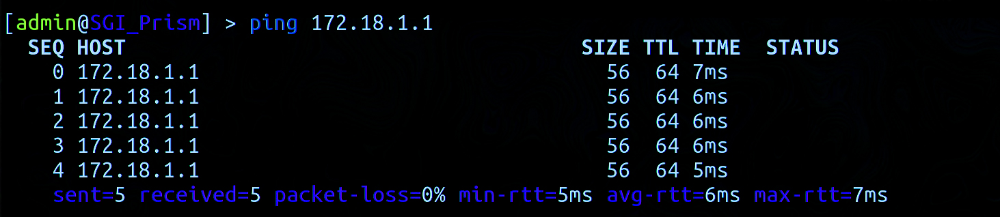

## Conclusion

As a result of the laboratory work, it was possible to get acquainted in practice with the OSPF, MPLS, EoMPLS protocols and the mechanisms of their organization.
