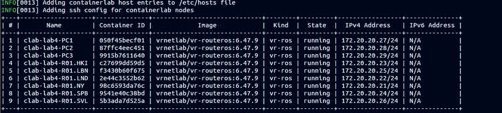
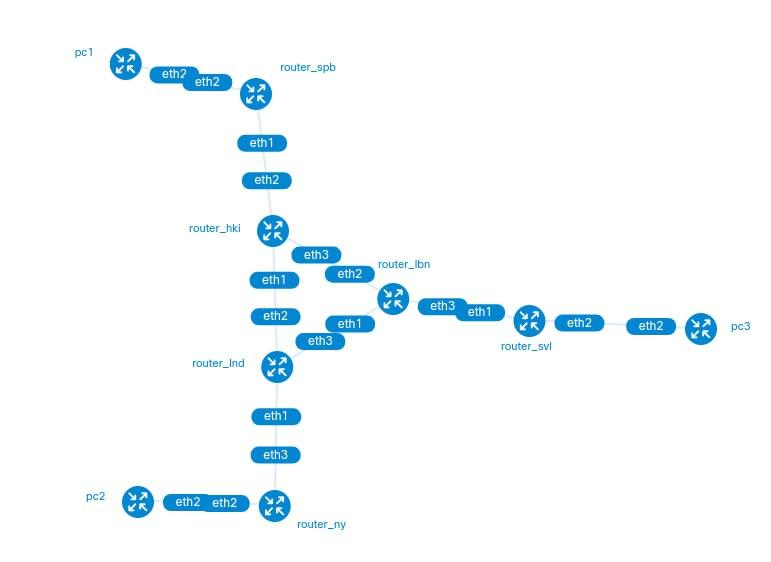
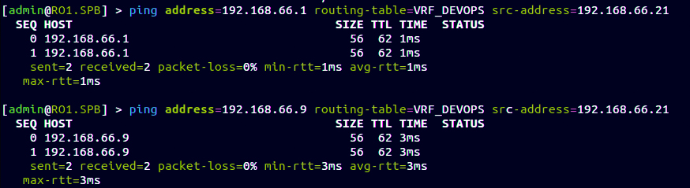
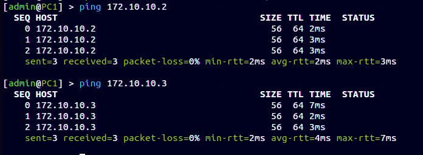

University: [ITMO University](https://itmo.ru/ru/)  
Faculty: [FICT](https://fict.itmo.ru)  
Course: [Introduction in routing](https://github.com/itmo-ict-faculty/introduction-in-routing)  
Year: 2024/2025  
Group: K3320  
Author: Rezkallah Kirollos  
Lab: Lab4  
Date of create: 9.12.2024  
Date of finished: 11.12.2024

# Laboratory work No. 4 "Emulation of a distributed corporate communication network, setting up bgp, organizing L3VPN, VPLS"

## The purpose of the work

To study the BGP, MPLS protocols and the rules of the L3 VPN and VPLS organization.

## Progress of work

### Test Network Deployment

<p align=center></p>

### The topology of the resulting network

<p align=center></p>

### Setting up the VRF

### RO1.HKI

```
add name=Lo
/interface wireless security-profiles
set [ find default=yes ] supplicant-identity=MikroTik
/routing ospf instance
set [ find default=yes ] router-id=10.0.14.1
/ip address
add address=172.31.255.30/30 interface=ether1 network=172.31.255.28
add address=172.40.40.18/30 interface=ether2 network=172.40.40.0
add address=10.0.14.1 interface=Lo network=10.0.14.1
add address=172.40.40.14/30 interface=ether3 network=172.40.40.0
add address=172.40.40.21/30 interface=ether4 network=172.40.40.0
/ip dhcp-client
add disabled=no interface=ether1
/mpls ldp
set enabled=yes
/mpls ldp interface
add interface=ether2
add interface=ether3
add interface=ether4
/routing bgp peer
add address-families=ip,l2vpn,l2vpn-cisco,vpnv4 name=peer1 remote-address=10.0.11.1 remote-as=65530 \
    route-reflect=yes update-source=Lo
add address-families=ip,l2vpn,l2vpn-cisco,vpnv4 name=peer2 remote-address=10.0.12.1 remote-as=65530 \
    route-reflect=yes update-source=Lo
add address-families=ip,l2vpn,l2vpn-cisco,vpnv4 name=peer3 remote-address=10.0.15.1 remote-as=65530 \
    update-source=Lo
/routing ospf network
add area=backbone
/system identity
set name=R01.HKI
```

### RO1.SPB

```
add name=Lo
/interface wireless security-profiles
set [ find default=yes ] supplicant-identity=MikroTik
/routing bgp instance
set default router-id=10.0.15.1
/routing ospf instance
set [ find default=yes ] router-id=10.0.15.1
/ip address
add address=172.31.255.30/30 interface=ether1 network=172.31.255.28
add address=10.0.15.1 interface=Lo network=10.0.15.1
add address=172.40.40.2/30 interface=ether2 network=172.40.40.0
add address=192.168.66.21/30 interface=ether3 network=192.168.66.20
/ip dhcp-client
add disabled=no interface=ether1
/ip route vrf
add export-route-targets=65530:100 import-route-targets=65530:100 interfaces=ether3 \
    route-distinguisher=65530:100 routing-mark=VRF_DEVOPS
/mpls ldp
set enabled=yes
/mpls ldp interface
add interface=ether2
/routing bgp instance vrf
add redistribute-connected=yes routing-mark=VRF_DEVOPS
/routing bgp peer
add address-families=ip,l2vpn,l2vpn-cisco,vpnv4 name=peer1 remote-address=10.0.14.1 remote-as=65530 \
    update-source=Lo
/routing ospf network
add area=backbone
/system identity
set name=R01.SPB
```

### Checking the connection

<p align=center></p>

### Setting up VPLS

### RO1.SPB

```
add name=Lo
add name=VPLS
/interface vpls
add disabled=no l2mtu=1500 mac-address=02:2D:B2:04:58:B5 name=vpls1 remote-peer=10.0.10.1 vpls-id=10:0
add disabled=no l2mtu=1500 mac-address=02:07:F9:C5:13:11 name=vpls2 remote-peer=10.0.13.1 vpls-id=10:0
/interface wireless security-profiles
set [ find default=yes ] supplicant-identity=MikroTik
/routing bgp instance
set default router-id=10.0.15.1
/routing ospf instance
set [ find default=yes ] router-id=10.0.15.1
/interface bridge port
add bridge=VPLS interface=ether3
add bridge=VPLS interface=vpls1
add bridge=VPLS interface=vpls2
/ip address
add address=172.31.255.30/30 interface=ether1 network=172.31.255.28
add address=10.0.15.1 interface=Lo network=10.0.15.1
add address=172.40.40.22/30 interface=ether2 network=172.40.40.0
add address=192.168.66.21/30 interface=ether3 network=192.168.66.0
/ip dhcp-client
add disabled=no interface=ether1
/mpls ldp
set enabled=yes
/mpls ldp interface
add interface=ether2
/routing bgp peer
add address-families=ip,l2vpn,l2vpn-cisco,vpnv4 name=peer1 remote-address=10.0.14.1 remote-as=65530 \
    update-source=Lo
/routing ospf network
add area=backbone
/system identity
set name=R01.SPB
```

### Checking the connection

<p align=center></p>

### Conclusion

As a result of the laboratory work, it was possible to get acquainted in practice with the BGP, MPLS protocols and the rules of the L3VPN and VPLS organization. The report considers only the configuration of the HKI-SPB-PC1 branch due to the symmetry of the entire network.
